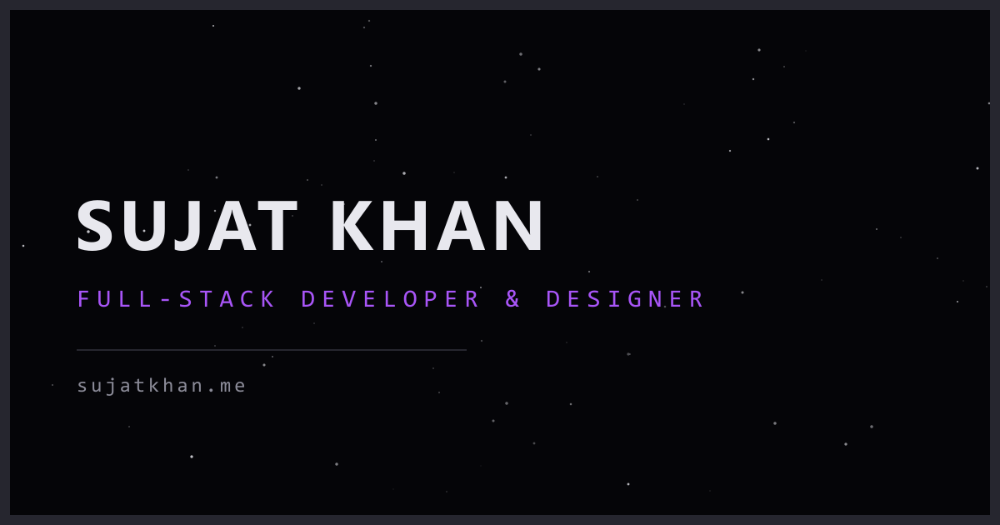

<p align="center">
  
</p>
<h1 align="center">
  Second Portfolio - v2
</h1>
<p align="center">
  The second iteration of <a href="portfolio-v2-alpha-olive.vercel.app" target="_blank">sujatkhan</a> built with Next.js 16 and React 19, leveraging Tailwind CSS v4, GSAP, and Lenis smooth scroll.
</p>
<p align="center">
  
</p>

## 🛠 set-up

1. Install the dependencies

   ```sh
   npm install
   ```

2. Start the development server

   ```sh
   npm run dev
   ```

## 🚀 build and run for production

1. Generate a full static production build

   ```sh
   npm run build
   ```

2. Start the production server

   ```sh
   npm start
   ```

## 🎨 color codes

| Color  | Hex                                                             |
| ------ | --------------------------------------------------------------- |
| Void   |  `#050508` |
| Surface|  `#101016` |
| Line   |  `#26262f` |
| Muted  |  `#8b8b98` |
| Ink    |  `#e8e8ee` |
| Purple |  `#a855f7` |
